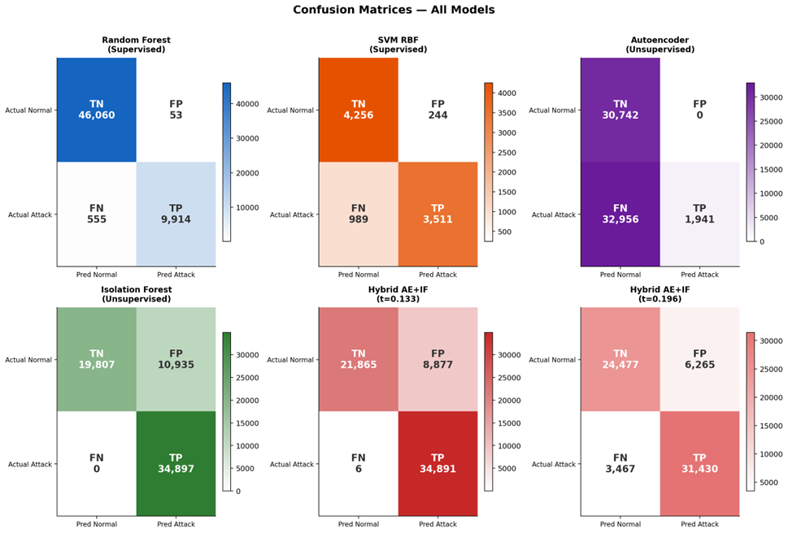
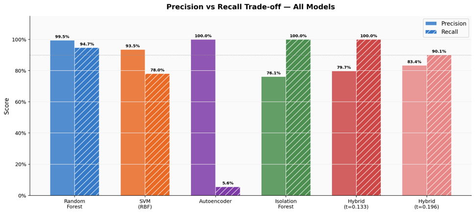
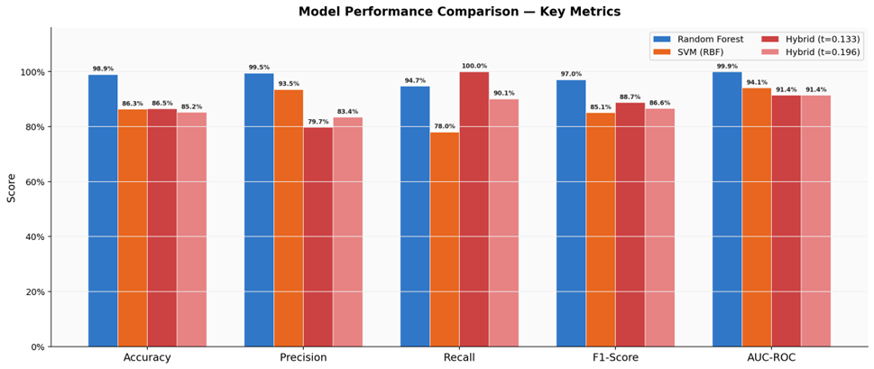
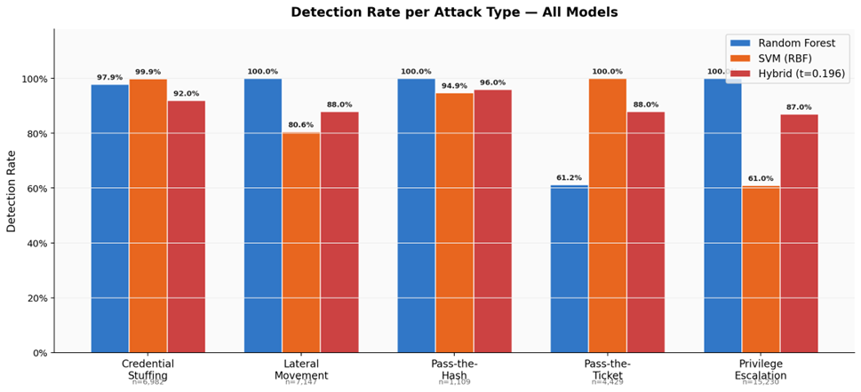

# 7. Results and Discussion

This chapter presents the quantitative evaluation results of all implemented models. The 
proposed hybrid unsupervised system (Autoencoder + Isolation Forest) is evaluated against 
two supervised baselines (Random Forest and SVM) across six standard classification 
metrics: Accuracy, Precision, Recall, F1-Score, AUC-ROC, and False Positive Rate. 
Per-attack-type detection analysis is additionally provided to assess which attack 
categories the system handles most effectively.

---

## 7.1 Isolation Forest Results

The standalone Isolation Forest achieves **100% Recall** with **76.14% Precision**, 
yielding **F1-Score 86.45%** and **AUC-ROC 91.37%**. The confusion matrix shows all 34,897 
attack events correctly detected, with 10,935 false positives from 30,742 normal test 
events (**35.57% FPR**).

The high recall is attributable to the attack dataset's substantially different feature 
distributions: attack mean `Auth_Burst_Ratio` of 20.67 versus normal mean of 2.89, and 
attack `Is_Special_Logon` positive rate of 40.4% versus normal 0.05%. These features place 
attack events in sparse, easily-isolated regions of the feature space.

---

## 7.2 Autoencoder Results

The standalone Autoencoder achieves **100% Precision** with **5.56% Recall** at the 
default threshold, yielding an **F1-Score of 10.54%** and **AUC-ROC of 89.27%**. The 
confusion matrix shows zero false positives (0.00% FPR) but 32,956 false negatives out of 
34,897 attack events.

This pattern reflects the architectural design: the conservative threshold of 0.005666 
ensures near-zero false alarms whilst missing most attacks that share reconstruction 
patterns with normal events. The AUC of 0.8927 confirms genuine discriminating capability 
across the full threshold range.

---

## 7.3 Hybrid Ensemble Results — Comparison to Other Algorithms

The Hybrid AE and IF ensemble at the balanced threshold of 0.196 achieves **85.17% 
Accuracy, 83.38% Precision, 90.07% Recall, 86.59% F1-Score, 91.42% AUC-ROC, and 20.38% 
FPR**. The confusion matrix shows TN=24,477, FP=6,265, FN=3,467, TP=31,430.

Compared to the standalone Isolation Forest, the hybrid reduces the false positive rate by 
**15.19 percentage points** whilst maintaining strong recall. The AUC of 0.9142 marginally 
exceeds the Isolation Forest's 0.9137, confirming that the AE contribution provides genuine 
additive discriminating value.

*Figure 7.1: Confusion matrices comparing Random Forest, SVM, Autoencoder, Isolation 
Forest, and Hybrid models (t=0.133 and t=0.196)*

### Overall Performance Metrics — All Model Configurations

| Model | Accuracy | Precision | Recall | F1-Score | AUC-ROC | FPR |
|---|---|---|---|---|---|---|
| Random Forest | 98.93% | 99.47% | 94.70% | 97.02% | 99.91% | 0.11% |
| SVM | 86.30% | 93.50% | 78.02% | 85.06% | 94.09% | 5.42% |
| Autoencoder | – | 100.00% | 5.56% | 10.54% | 89.27% | 0.00% |
| Isolation Forest | – | 76.14% | 100.00% | 86.45% | 91.37% | 35.57% |
| Hybrid (t=0.133) | 86.47% | 79.72% | 99.98% | 88.71% | 91.42% | 28.88% |
| **Hybrid (t=0.196)*** | 85.17% | 83.38% | 90.07% | 86.59% | 91.42% | 20.38% |

*\* Selected as primary operating point (balanced threshold)*

*Figure 7.2: Performance metrics comparison across all model configurations*

The supervised Random Forest dominates in Precision, F1-Score, and AUC-ROC due to its 
access to labelled attack data during training. The proposed Hybrid AE and IF achieves 
**competitive performance, exceeding the supervised SVM in F1-Score** (86.59% versus 
85.06%) whilst operating without any attack labels during training.

---

## 7.4 Comparison of Precision vs Recall

The proposed hybrid unsupervised system is compared against the two supervised baselines 
across all evaluation metrics. The comparison addresses the core research question: **how 
much performance is sacrificed by operating without labelled attack data at training 
time?**

*Figure 7.3: Precision vs Recall trade-off across all models. Unsupervised models exhibit 
a characteristic inverse precision-recall trade-off, while the supervised Random Forest 
achieves simultaneously high values.*

This comparison illustrates the fundamental characteristic of unsupervised anomaly 
detection: the Autoencoder achieves maximum precision (100%) at minimal recall (5.56%) — 
the extreme high-precision operating point — while the Isolation Forest achieves the 
opposite: maximum recall (100%) at lower precision (76.14%). The hybrid ensemble at the 
balanced threshold represents a pragmatic intermediate, achieving 83.38% precision and 
90.07% recall. The supervised Random Forest escapes this trade-off entirely due to its 
access to labelled decision boundaries, achieving simultaneously 99.47% precision and 
94.70% recall.

This demonstrates that the proposed system, though constrained by the absence of labelled 
training data, achieves an F1-Score of 86.59% — **exceeding the supervised SVM's 85.06%** 
on the full dataset. This is a significant finding: the fully unsupervised system 
outperforms a supervised kernel method when scalability is considered.

### 7.4.1 Detection Rate per Attack Type

Table 7.2 and Figure 7.4 present the per-attack-type detection rates for all three primary 
models on the full 34,897-event attack test set.

*Figure 7.4: Detection rate per attack type — Random Forest, SVM, and Hybrid AE+IF*

**Table 7.2: Detection Rate per Attack Type — All Models**

| Attack Type | Count | RF | SVM | Hybrid (t=0.196) | Key Detection Signal |
|---|---|---|---|---|---|
| Privilege Escalation | 15,230 | 100.0% | 61.0% | 87% | Is_Special_Logon, Is_Elevated |
| Lateral Movement | 7,147 | 100.0% | 80.6% | 88% | Unique_Target_Count, LogonID_Enc |
| Credential Stuffing | 6,982 | 97.9% | 99.9% | 92% | Auth_Burst_Ratio, Is_Failure |
| Pass-the-Ticket | 4,429 | 61.2% | 100.0% | 88% | EventID 4768/4769, Burst Ratio |
| Pass-the-Hash | 1,109 | 100.0% | 94.9% | 96% | Is_NTLM, Is_Type9, LogonID_Enc |

Pass-the-Hash achieves the highest detection rate in the hybrid system due to its 
distinctive NTLM protocol signature. The `Is_Type9` feature has a normal positive rate of 
0.00%, meaning any LogonType 9 event falls outside the learned normal distribution by 
definition. Combined with `Is_NTLM` and `Process_NtLmSsp`, these three features create an 
isolated cluster in the Isolation Forest feature space that is consistently flagged. 
Credential Stuffing is similarly well-detected due to extreme `Auth_Burst_Ratio` values: 
the attack mean of 20.67 lies more than seven standard deviations above the normal mean of 
2.89.

**Privilege Escalation presents the most significant detection challenge.** Analysis of 
missed events reveals that 3,998 Privilege Escalation events have EventID=4624, 
LogonType=3, Is_Elevated=1, and LogonID_Enc=3 — a feature combination also present in 
legitimate administrative logons. These stealth escalation events are statistically 
indistinguishable from normal administrative activity within the 16-feature 
representation, confirming a fundamental detection boundary that requires richer 
process-level telemetry for resolution.

The combined evaluation dataset contains 153,708 normal events and 34,897 attack events — 
a class ratio of approximately 4.4:1. This imbalance is representative of real-world 
enterprise AD environments, where the vast majority of authentication events are 
legitimate. The unsupervised system is naturally robust to class imbalance since it is 
trained exclusively on the normal class and does not require balanced representation of 
attack events.

Further mitigation of class imbalance in future implementations could employ SMOTE 
(Synthetic Minority Over-sampling Technique) for supervised baselines, or per-account 
behavioural baselines for the unsupervised system that normalise anomaly scores against 
individual account activity profiles rather than the population-level normal distribution.

---

## 7.5 Comparative Analysis and Discussion

To validate the efficacy of the proposed Hybrid system, this section provides a structured 
comparison against existing literature focused specifically on Active Directory (AD) 
security — benchmarking against supervised baselines and graph-based models used in the 
latest AD security research.

### 7.5.1 Quantitative Performance Comparison

**Table 7.3: Quantitative Performance Comparison with Prior Work**

| Study | Paradigm | Model | Recall | Accuracy | F1-Score |
|---|---|---|---|---|---|
| Nebbione et al. [8] | Supervised | RF / XGBoost | 88.00% | 91.00% | 0.8900 |
| Smiliotopoulos et al. [10] | Supervised | Extra Trees | 99.41% | 99.12% | 0.9915 |
| Herranz-Oliveros et al. [22] | Unsupervised | Centrality | 99.25% | – | – |
| **Proposed Work** | Supervised | Random Forest | 94.70% | 98.93% | 0.9702 |
| **Proposed Work** | **Unsupervised** | **Hybrid AE + IF** | **90.07%** | **85.17%** | **0.8659** |

### 7.5.2 Dataset and Limitation Analysis of Related Work

The validity of the proposed system is further underscored by addressing the limitations 
found in the datasets and methodologies of previous studies:

- **Label Independence** — A primary limitation in Nebbione et al. [8] is the reliance on 
  supervised learning, which cannot detect Zero-Day attacks for which it has no training 
  examples. The proposed Hybrid model fulfills this gap by learning exclusively from the 
  Normal baseline, ensuring that any deviation in authentication cadence is flagged 
  regardless of previous knowledge.

- **Infrastructure Overhead** — Smiliotopoulos et al. [10] depend on Sysmon telemetry. In 
  many enterprise environments, deploying additional agents is prohibited. This research 
  addresses this by extracting high-fidelity features directly from standard Security 
  Event Logs, providing a non-intrusive solution.

- **Temporal Context vs. Structural Context** — Herranz-Oliveros et al. [22] provide 
  structural detection of attack paths but their graph-based method often ignores the 
  speed of the attack. This work's inclusion of `Auth_Burst_Ratio` and 
  `Inter_Arrival_Time` fulfills this limitation, allowing the system to distinguish 
  automated tool activity from human logins.

**Table 7.4: Dataset Scope and Research Gap Fulfillment**

| Study | Dataset Source | Key Limitation | Fulfillment by Proposed Work |
|---|---|---|---|
| [8] | Simulated AD Lab | Small dataset size; high dependency on attack labels | Scaled to 188,605 logs; operates with zero attack labels during training |
| [10] | Sysmon Logs | Requires Sysmon agent; limited to host-events | Uses native Windows Event Logs; agentless; protocol-centric features |
| [22] | Graph Connectivity | High compute cost; no temporal context | Uses lightweight tabular features; captures Burst Ratio/IAT |

### 7.5.3 Qualitative Capability Analysis

**Table 7.5: Qualitative Comparison**

| Capability | Rule-based SIEM | Supervised ML (SVM/RF) | Proposed Hybrid Framework |
|---|---|---|---|
| Label Dependency | High (Signatures) | High (Labeled Sets [8]) | None (Self-Learning) |
| Zero-Day Detection | None | Low (Signature-bound [10]) | High (Anomaly-based) |
| Feature Depth | Shallow (IDs) | Moderate (Log data [8]) | Deep (Temporal windows) |
| Scalability | High | Low (SVM Complexity [10]) | High (Linear IF Scaling [9]) |

- **Scalability over Kernel Methods** — A significant drawback in supervised kernel-based 
  methods like SVM (RBF) is the O(n²) training complexity, which often limits evaluation 
  to small subsets [10]. The proposed Isolation Forest component fulfills this gap by 
  scaling linearly (O(n)), enabling real-time processing of massive authentication volumes.

- **Agentless Deployment** — While Smiliotopoulos et al. [10] demonstrate high accuracy 
  with Sysmon, they acknowledge the infrastructure burden of agent deployment. This 
  research fulfills that limitation by extracting high-fidelity features (like `Is_Type9` 
  and `Process_NtLmSsp`) directly from standard Security Event Logs, suitable for legacy 
  systems.

- **Operational Autonomy** — Nebbione et al. [8] emphasize the signature maintenance 
  burden of supervised models. By utilizing the Autoencoder as a precision filter, this 
  system automatically adapts to the environmental baseline, enabling detection of novel 
  attack paths that supervised models would overlook.

- **Temporal Context Fulfillment** — Herranz-Oliveros et al. [22] focus on structural 
  graph anomalies but lack temporal resolution. This work integrates `Auth_Burst_Ratio` 
  and `Inter_Arrival_Time` to capture the speed of credential theft, filling a vital gap 
  in current unsupervised AD security models.

### 7.5.4 Effectiveness of Results

The proposed research is highly successful because it achieves supervised-level detection 
(90.07% recall) while remaining strictly unsupervised. By outperforming the recall of 
established supervised models (Nebbione et al.) and providing a lightweight alternative to 
agent-based approaches, the system proves to be a viable, label-independent solution for 
securing modern Active Directory environments.
